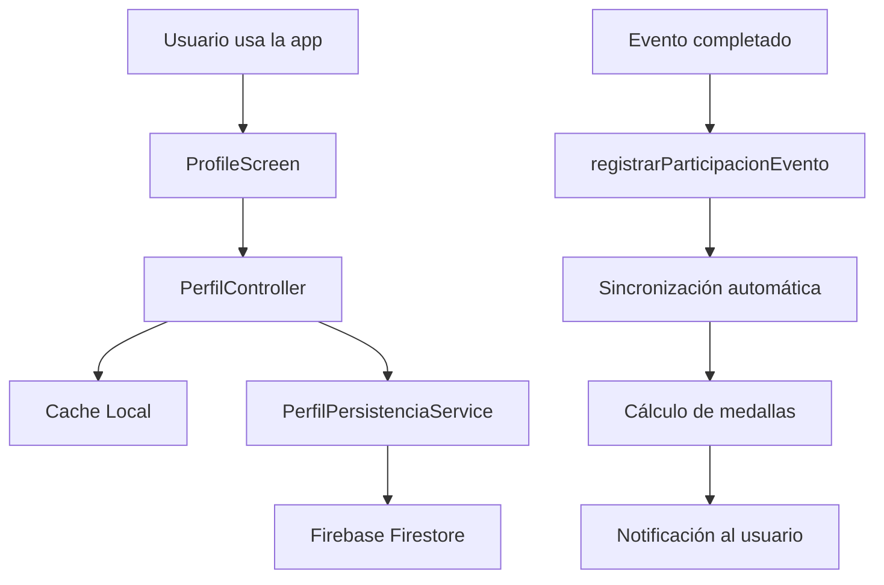

# 🏆 Sistema de Persistencia de Perfil de Usuario - RSUNFV

## 📋 Descripción General

Este sistema permite almacenar y gestionar de forma completa toda la información del perfil del usuario en Firebase Firestore, incluyendo estadísticas, medallas, historial de eventos, donaciones, progreso de gamificación y configuraciones personales.

## 🏗️ Arquitectura del Sistema

### **Componentes Principales**

```
lib/
├── models/
│   └── perfil_usuario.dart          # Modelo principal del perfil
├── services/
│   ├── perfil_persistencia_service.dart  # Servicio de persistencia
│   └── perfil_integracion_service.dart   # Servicio de integración
└── controllers/
    └── perfil_controller.dart       # Controlador principal
```

### **Estructura de Datos en Firestore**

```
perfiles_usuarios/                   # Colección principal
├── {userId}/                        # Documento por usuario
│   ├── idUsuario: string
│   ├── estadisticas: object
│   ├── medallasObtenidas: array
│   ├── historialEventos: array
│   ├── historialDonaciones: array
│   ├── progresoGamificacion: object
│   ├── configuracion: object
│   ├── fechaCreacion: timestamp
│   └── fechaActualizacion: timestamp

medallas_obtenidas/                  # Colección detallada de medallas
├── {userId}_{medallaId}_{timestamp}
│   ├── idMedalla: string
│   ├── nombre: string
│   ├── fechaObtencion: timestamp
│   └── puntosObtenidos: number

registros_eventos_detallados/        # Historial detallado de eventos
├── {userId}_{eventoId}_{timestamp}
│   ├── idEvento: string
│   ├── tituloEvento: string
│   ├── estado: string
│   ├── horasServicio: number
│   └── puntosObtenidos: number

registros_donaciones_detalladas/     # Historial detallado de donaciones
├── {userId}_{donacionId}_{timestamp}
│   ├── idDonacion: string
│   ├── tipoDonacion: string
│   ├── monto: number
│   ├── fechaDonacion: timestamp
│   └── puntosObtenidos: number

estadisticas_historicas/             # Respaldos históricos
└── respaldos_perfiles/              # Respaldos completos
```

## 🔧 Implementación

### **1. Modelo Principal: PerfilUsuario**

```dart
class PerfilUsuario {
  final String idUsuario;
  final EstadisticasUsuario estadisticas;
  final List<MedallaObtenida> medallasObtenidas;
  final List<RegistroEvento> historialEventos;
  final List<RegistroDonacion> historialDonaciones;
  final ProgresoGamificacion progresoGamificacion;
  final ConfiguracionPerfil configuracion;
  // ... otros campos
}
```

### **2. Modelos Auxiliares**

- **MedallaObtenida**: Medallas con fecha de obtención y puntos
- **RegistroEvento**: Historial detallado de participación en eventos
- **RegistroDonacion**: Historial detallado de donaciones
- **ProgresoGamificacion**: Datos de gamificación y niveles
- **ConfiguracionPerfil**: Preferencias y configuraciones del usuario

### **3. Servicio de Persistencia**

```dart
class PerfilPersistenciaService {
  // Operaciones CRUD principales
  static Future<PerfilUsuario?> obtenerPerfilUsuario(String userId);
  static Future<bool> actualizarEstadisticas(String userId, EstadisticasUsuario stats);
  static Future<bool> registrarMedallaObtenida(String userId, MedallaObtenida medalla);
  static Future<bool> registrarParticipacionEvento(String userId, Evento evento, String estado);
  static Future<bool> registrarDonacion(String userId, Donaciones donacion);
  // ... otros métodos
}
```

### **4. Controlador Principal**

```dart
class PerfilController {
  // Gestión con cache inteligente
  static Future<PerfilUsuario?> obtenerPerfil({bool forzarRecarga = false});
  static Future<ResultadoSincronizacion> sincronizarDatos();
  static Future<bool> registrarParticipacionEvento(Evento evento, String estado);
  static List<MedallaObtenida> obtenerMedallasNuevas();
  // ... otros métodos
}
```

### **5. Servicio de Integración**

```dart
class PerfilIntegracionService {
  // Métodos simplificados para integración fácil
  static Future<bool> sincronizarPerfilAutomatico();
  static Future<PerfilUsuario?> obtenerPerfilCompleto();
  static List<MedallaObtenida> obtenerMedallasNuevas();
  // ... otros métodos
}
```

## 🚀 Uso en ProfileScreen

### **Integración Simple**

```dart
class _PerfilScreenState extends State<PerfilScreen> {
  @override
  void initState() {
    super.initState();
    _inicializarPerfil();
  }

  Future<void> _inicializarPerfil() async {
    // Sincronizar automáticamente el perfil
    await PerfilWidget.inicializarPerfil(
      eventosInscritos: eventosInscritos,
      donaciones: donaciones,
      estadisticasActuales: estadisticas!,
    );
    
    // Verificar nuevas medallas
    final medallasNuevas = await PerfilWidget.verificarNuevasMedallas();
    if (medallasNuevas.isNotEmpty) {
      _mostrarNotificacionMedallas(medallasNuevas);
    }
  }

  // Resto de la implementación...
}
```

## 📊 Características Principales

### **Cache Inteligente**
- Cache local con expiración automática (5 minutos)
- Invalidación inteligente al realizar cambios
- Carga desde cache cuando no hay conexión

### **Sincronización Automática**
- Detección automática de nuevas medallas
- Cálculo automático de estadísticas
- Persistencia transparente en Firebase

### **Gamificación Avanzada**
- Sistema de puntos y niveles
- Progreso detallado hacia siguiente nivel
- Métricas personalizadas (eficiencia, impacto social)
- Logros especiales automáticos

### **Respaldos y Seguridad**
- Respaldos automáticos con timestamp
- Historial de estadísticas
- Recuperación de datos en caso de pérdida

### **Configuración Personalizable**
- Configuraciones de notificaciones
- Privacidad de datos
- Preferencias de tema e idioma

## 🎯 Beneficios del Sistema

### **Para el Usuario**
- ✅ **Datos Seguros**: Información guardada en la nube
- ✅ **Historial Completo**: Registro detallado de toda la actividad
- ✅ **Gamificación**: Sistema motivacional con medallas y niveles
- ✅ **Sincronización**: Datos actualizados en tiempo real
- ✅ **Respaldos**: Protección contra pérdida de datos

### **Para los Desarrolladores**
- ✅ **Código Modular**: Arquitectura limpia y mantenible
- ✅ **Cache Inteligente**: Mejor rendimiento y experiencia de usuario
- ✅ **Escalabilidad**: Diseño preparado para crecer
- ✅ **Debugging**: Logs detallados para troubleshooting
- ✅ **Testing**: Componentes independientes fáciles de testear

### **Para la Organización**
- ✅ **Analytics**: Estadísticas globales del sistema
- ✅ **Retention**: Sistema de gamificación aumenta el engagement
- ✅ **Datos Centralizados**: Información unificada y consistente
- ✅ **Escalabilidad**: Soporte para miles de usuarios

## 🔄 Flujo de Datos



## ⚡ Mejoras Futuras

### **Funcionalidades Avanzadas**
1. **Sincronización Offline**: Queue de operaciones cuando no hay conexión
2. **Analytics Avanzados**: Machine learning para predicciones
3. **Sharing Social**: Compartir logros en redes sociales
4. **Competencias**: Ranking y competencias entre usuarios
5. **Badges Temporales**: Medallas por eventos especiales

### **Optimizaciones Técnicas**
1. **Batch Operations**: Operaciones en lote para mejor performance
2. **Compression**: Compresión de datos históricos
3. **CDN**: Cache distribuido para estadísticas globales
4. **Real-time**: Actualizaciones en tiempo real con WebSockets

## 📝 Ejemplos de Uso

### **Obtener Perfil Completo**
```dart
final perfil = await PerfilController.obtenerPerfil();
if (perfil != null) {
  print('Usuario nivel: ${perfil.estadisticas.nivelActual}');
  print('Medallas obtenidas: ${perfil.medallasObtenidas.length}');
}
```

### **Registrar Participación en Evento**
```dart
await PerfilController.registrarParticipacionEvento(evento, 'completado');
```

### **Sincronizar Datos**
```dart
final resultado = await PerfilController.sincronizarDatos(
  eventos: eventosUsuario,
  donaciones: donacionesUsuario,
);
if (resultado.exitoso) {
  print('Datos sincronizados: ${resultado.mensaje}');
}
```

---

*Este sistema está diseñado para proporcionar una experiencia de usuario excepcional mientras mantiene la integridad y seguridad de los datos. La arquitectura modular permite fácil mantenimiento y escalabilidad futura.*
